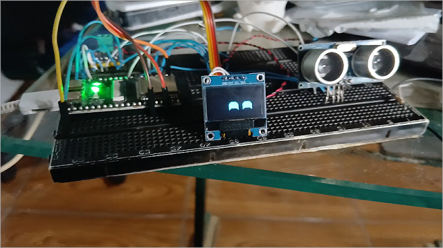
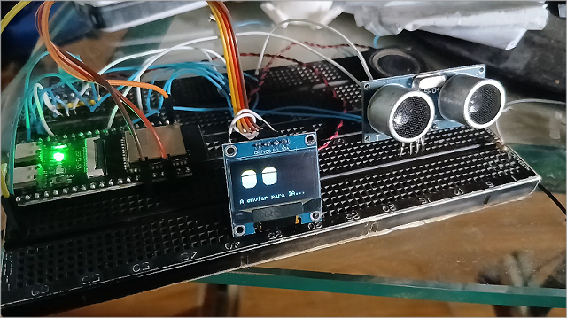
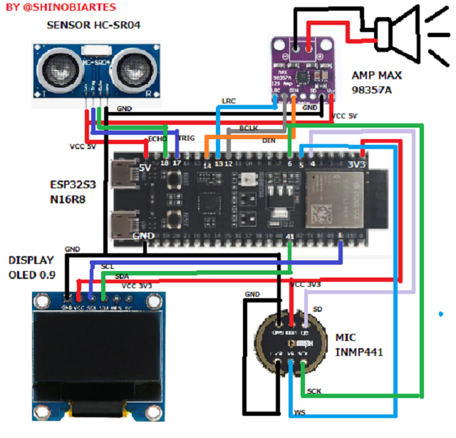

# 🚀 [Fiz meu proprio chatbot usando esp32s3]

## 📸 CHATBOT COM ESP32

## 📸 Circuito e Montagem

Este repositório contém todos os arquivos necessários para replicar o projeto apresentado no canal **[ShinobiArts]**.

---

## 📺 Assista ao Vídeo do Projeto

---

## 📋 Descrição do Projeto
Neste projeto, utilizamos um **ESP32** para [INTERAGIR COM UM CHATBOT INCRIVEL].

## 🛠️ Materiais Utilizados
* 1x ESP32-S3
* Display OLED
* 👀 Sensor Ultrassônico HC-SR04
* 🎤 Microfone INMP441
* 🔊 Amplificador MAX98357A

## 📁 Estrutura de Arquivos
* **/Codigo**: Contém o arquivo `.ino` para Arduino IDE.
* **/Esquematicos**: Diagrama de montagem e circuito.
* **bibliotecas.txt**: *ASSISTA O VIDEO

---

## 🚀 Como baixar e usar?
1. Clique no botão verde **Code** lá no topo.
2. Selecione **Download ZIP**.
3. Extraia os arquivos no seu computador.
4. Abra o código na Arduino IDE, instale as bibliotecas e faça o Upload!

---
💡 *Gostou? Não esqueça de se inscrever no canal e deixar o like!*

## 📺 Follow me on You tube

)

